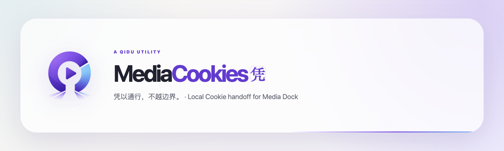

# MediaCookies · 凭

> 凭以通行，不越边界。<br>
> Pass by permission, never beyond the boundary.

**A QIDU Utility**

MediaCookies · 凭是 Media Dock 的浏览器登录状态导出助手。“凭”代表用户亲自授予的通行权限，而不是越过浏览器边界。Media Dock 用户在已登录的媒体网页上打开扩展，即可把当前来源交给 Media Dock；熟悉 Cookie 或 yt-dlp 的用户，可以进入导出工作台扫描、预览并组合多个来源。

MediaCookies 默认使用简体中文，也可以在界面中手动切换为 English。它不会根据浏览器语言自动切换。

## 使用方式

### 快速导出

1. 在 Chrome 或 Edge 中打开并登录目标媒体网页。
2. 打开 MediaCookies。
3. 按提示授予当前来源的访问权限，然后选择“导出给 Media Dock”。
4. 在 Media Dock 中导入刚下载的 Cookie 包。

快速导出只处理当前网页对应的来源，并用“可以导出 / 请先登录 / 可能失效 / 当前网页不支持”说明下一步。

如果希望一次查看整个浏览器，可选择“识别整个浏览器”。MediaCookies 会在这次点击后申请全来源访问，随后自动打开导出工作台，并先整理 Media Dock 支持的媒体站点；目标网站没有出现时，再切换到“全部 Cookie 域名”。Cookie 值仍只在本次页面内存中处理。

### 导出工作台

从快速导出界面进入“导出工作台”，可以：

- 在用户明确操作后扫描受支持的来源；
- 预览域名、名称、路径、有效期、状态和安全标记，不显示 Cookie 值；
- 选择多个来源并导出兼容 Media Dock 的 Cookie 包；
- 保存常用来源，方便下次快速选择。

工作台提供两种扫描范围：

- `媒体站点（推荐）`：只显示内置来源和 Media Dock 下载工具（yt-dlp）支持的媒体站点，适合绝大多数导出。
- `全部 Cookie 域名`：按域名显示浏览器中所有可访问的 Cookie，可能包含邮箱、购物或其他与媒体下载无关的站点；仅在目标网站没有出现在推荐结果时使用。

两种范围使用相同的本地扫描授权。“可以导出 / 需确认 / 请先登录”描述的是登录状态，并不表示扫描范围；其中“需确认”表示登录标记无法验证或 Cookie 临近过期。

所有 Cookie 包统一使用本机导出时间命名，例如 `MediaCookies_2026-07-13_18-24-36.zip`。浏览器实际下载文件与 ZIP 根目录使用同一个名称；格式不包含冒号，可在 Windows、macOS 和 Linux 中安全使用，并能按文件名自然排序。

## 安装

- Chrome Web Store：[MediaCookies](https://chromewebstore.google.com/detail/xf-mediacookies/pkpnjlcfhkgiapclmidlhfgjklhifcek)
- GitHub Releases：[下载发布包](https://github.com/Yifo98/MediaCookies/releases/latest)
- 本地开发：运行 `npm install` 与 `npm run build`，然后在浏览器扩展管理页加载项目根目录或 `dist/` 目录。根目录入口会明确加载最新的 `dist/` 构建，不会直接运行 TypeScript 源文件。

MediaCookies 只分发 Manifest V3 浏览器扩展 ZIP，不提供 EXE、MSI、BAT、CMD、PowerShell 或 Native Messaging Host。Windows 11 Smart App Control 不要求把纯扩展 ZIP 改装成 BAT；BAT 也不能替未签名 EXE 绕过执行检查。官方资料与项目边界见 [`docs/research/windows-smart-app-control.md`](docs/research/windows-smart-app-control.md)。

## 隐私边界

- 安装时不申请任何网站的固定访问权限；只有用户发起操作时才按需请求。
- 不申请“管理下载”权限；Cookie 包通过扩展页面的标准下载能力直接保存到本机。
- 快速导出只读取当前来源；全来源权限只在用户点击“识别整个浏览器”或工作台扫描按钮后申请。
- Cookie 值只用于生成本地 Cookie 包，不显示在界面或偏好存储中。
- 扩展不上传 Cookie、密码、令牌或诊断数据，也不包含网络上报端点。
- 导出的 `cookies.txt` 含有敏感登录状态，应只在本机交给 Media Dock，并在使用后妥善保管或删除。

## 开发与验证

```bash
npm run validate
npm run validate:assets
npm run test
npm run typecheck
npm run build
npm run package
npm run check
```

`npm run package` 会生成 `release/mediacookies-<version>.zip`，并拒绝把 Windows 可执行文件、安装器、动态库或脚本启动器混入商店包。`npm run check` 串行执行项目校验、发布素材校验、测试、类型检查、构建和打包。

浏览器验收范围见 [`docs/testing/browser-acceptance.md`](docs/testing/browser-acceptance.md)，架构决策见 [`docs/adr/`](docs/adr/)，商店与 GitHub 素材说明见 [`docs/brand/publishing-assets.md`](docs/brand/publishing-assets.md)。

## Media Dock 打包集成

Media Dock 可以在打包时通过以下环境变量读取本项目：

```bash
MEDIA_DOCK_COOKIE_EXTENSION_PROJECT_DIR=/path/to/MediaCookies npm run dist:mac
```

Media Dock 的分享包会包含 MediaCookies 发布包与用于本地加载的 `dist/` 目录。
